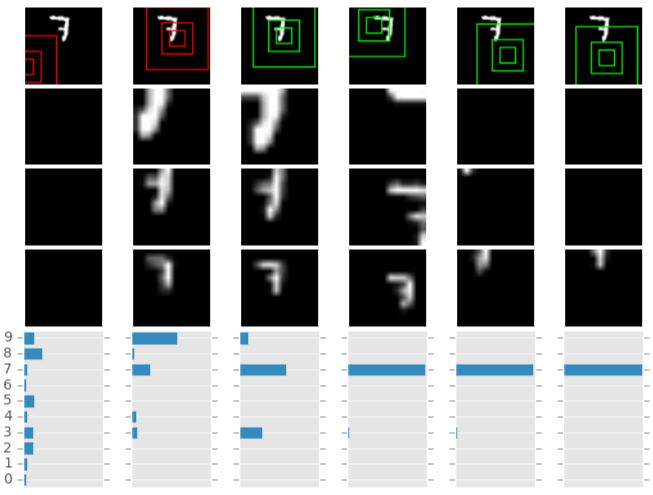

# Recurrent Attention Model

Recurrent Attention Model with Chainer based on the following paper  
[arXiv:1406.6247](http://arxiv.org/abs/1406.6247): Recurrent Models of Visual Attention [Volodymyr Mnih+ 2014]  

## Features  

* RAM model difinition on Chainer  
* script to train RAM & infer with RAM 
* translated MNIST & translated and cluttered MNIST task

### not yet implemented  

* hyper-parameters to get the best scores in the paper on cluttered MNIST  

## Examples  

glimpses and output probabilities at each time step  

* original MNIST  

  

* translated MNIST  

  


## Dependencies  
Python(2 or 3), Chainer, PIL, matplotlib, tqdm  

## Usage  
train.py: optimizes weights of a RAM model and ouputs learned weights to \*.chainermodel file every 100 epoch

* with "--original" for 28x28 original MNIST task, "--translated" for 60x60 translated MNIST, and "--cluttered" for 60x60 translated and cluttered MNIST
* trained on CPU with default setting or GPU with "-g your_GPU_device_ID"

```shellsession
➜ python train.py --original  
```

infer.py: plot result of inference by a trained RAM model (result will show up with your matplotlib's backend)  

```shellsession
➜ python infer.py --original -m ram_original_epoch*.chainermodel  
```
